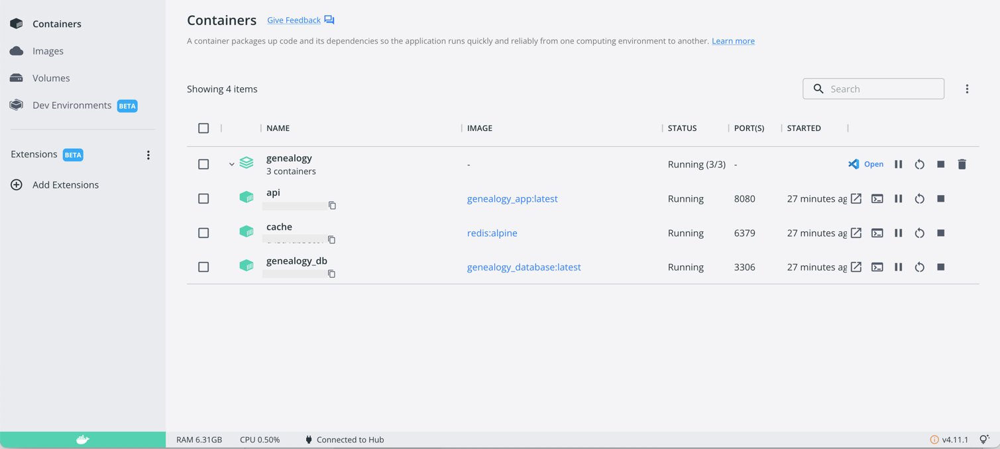
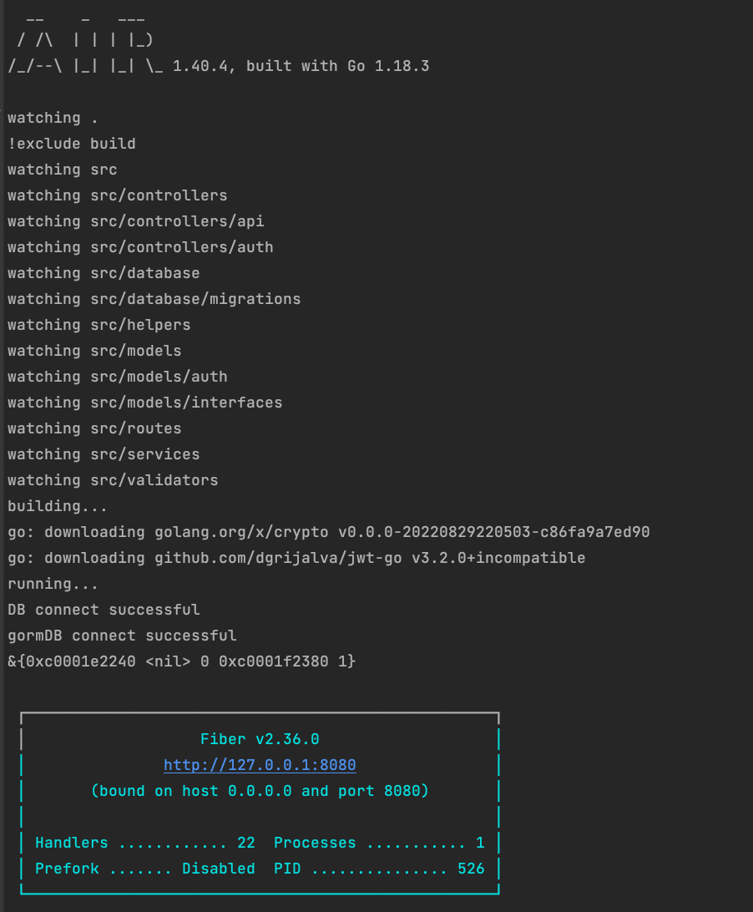

<!-- PROJECT LOGO -->
<br />
<div align="center">
    
    <h3 align="center">SOL Genealogy</h3>
    <p align="center">
        Genealogy management APIs
        <br />
        <br />
        <a href="">View Demo</a>
        ·
        <a href="https://github.com/solvntech/authentication/issues">Report Bug</a>
        ·
        <a href="https://github.com/solvntech/authentication/issues">Request Feature</a>
    </p>
</div>

<!-- TABLE OF CONTENTS -->
<ol>
    <li><a href="#getting-started">Getting Started</a></li>
    <li><a href="#setup-developer-environment">Setup developer environment</a></li>
    <li><a href="#installation">Installation</a></li>
</ol>

<!-- GETTING STARTED -->
## Getting Started

_Coming soon..._

## Setup developer environment

* Install Version Control: [https://git-scm.com/](https://git-scm.com/)
* Install Docker: [https://www.docker.com/get-started/](https://www.docker.com/get-started/)
* Install Golang 1.18: [https://go.dev/dl/](https://go.dev/dl/)

## Installation
1. Clone the repo
   ```sh
   git clone https://github.com/solvntech/genealogy.git
   git switch BE
   ```
2. Install containers required
   ```sh
   docker-compose up
   ```

   

3. Copy from `.env.example` to `.env` and configure in `.env`
   ```dotenv
    # mysql config
    MYSQL_USER=dbuser
    MYSQL_PASSWORD=dbpass
    MYSQL_HOST=database
    MYSQL_PORT=3306
    MYSQL_DATABASE=genealogy
    MYSQL_ROOT_PASSWORD=admin
   
    # api port
    API_PORT=3000
   
    # cache port (redis)
    CACHE_PORT=6379
   
    # private key
    PRIVATE_KEY=SecretTokenSecretToken
   ```

4. Logging Server
   ```sh
   docker logs -f api
   ```
   